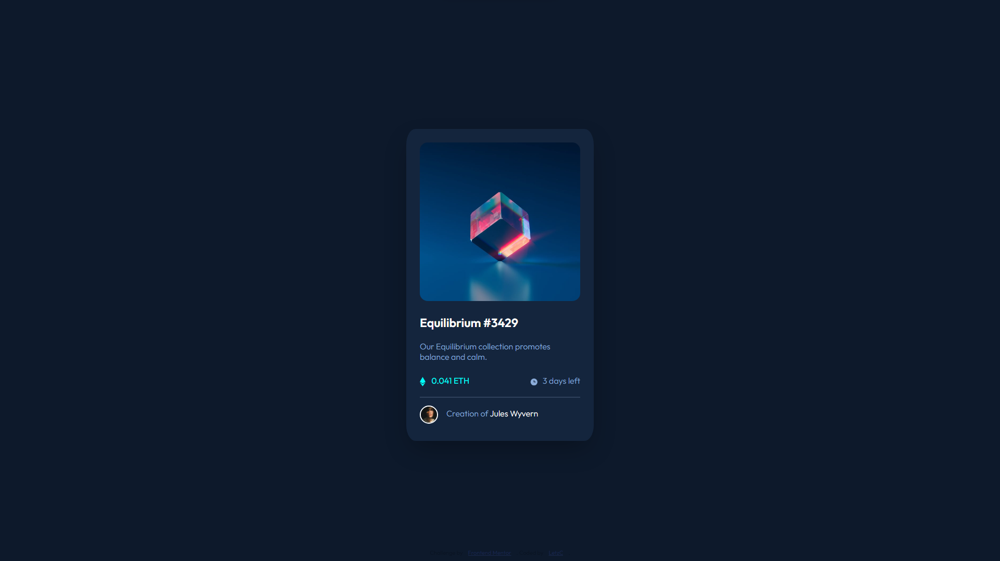

# Frontend Mentor - NFT preview card component solution

This is a solution to the [NFT preview card component challenge on Frontend Mentor](https://www.frontendmentor.io/challenges/nft-preview-card-component-SbdUL_w0U). Frontend Mentor challenges help you improve your coding skills by building realistic projects. 

## Table of contents

- [Overview](#overview)
  - [The challenge](#the-challenge)
  - [Screenshot](#screenshot)
  - [Links](#links)
  - [Built with](#built-with)
  - [What I learned](#what-i-learned)
  - [Continued development](#continued-development)
  - [Useful resources](#useful-resources)
- [Author](#author)

## Overview

### The challenge

Users should be able to:

- View the optimal layout depending on their device's screen size
- See hover states for interactive elements

### Screenshot

### Links

- Solution URL: [Nft Card](https://letzc.github.io/nft-card/)

### Built with

- Semantic HTML5 markup
- CSS custom properties
- Flexbox

### What I learned

- ### Using rem and % responsive measures:
   To make it easier to measure, I defined the HTML with `font-size: 62.5%`, so every 1rem will be considered 10px. This made it easier to be responsive on 4k screens. Increasing the measure of HTML, `rem` elements have followed suit. 
- ### Alignment of elements:
   I mostly enjoyed using `flex`, `align-items` and `justify-content`.
- ### Effects:
   This was one of the biggest challenges, due to the hover of the image. I tried to set the background to the eye icon. Other solutions I tried were: coloring the image, applying a div with a background and lowering the opacity. I opted for the background on the icon, as I would adjust a single element. The other hover effects were pretty straightforward. I added a slight transition to smooth the passage.
- ### Responsiveness:
   As the project was already being built using responsive solutions, it was necessary to make small adjustments. I made the responsiveness based on the browser breakpoints.

### Continued development

My next steps will be to train more responsiveness. I intend to apply sass to this project for better code organization.

### Useful resources

- [Responsiveness](https://github.com/rocketseat-content/youtube-masterclass-responsividade) - I learned very interesting concepts with this repository, I will continue to apply these concepts in the next projects. I recommend it to everyone who wants to learn more about it.

## Author

- Frontend Mentor - [@LetzC](https://www.frontendmentor.io/profile/LetzC)
